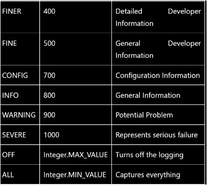

# Learning Resources for Javaa Spring

## Contents   

1. [Popular Reference Sites](#popular-reference-sites)
   - [WebSites](#websites)
   - [Youtube Channels](#youtube-channels)
   - [Courses](#courses)
1. [Core Java Concepts](#core-java-concepts)
2. [Logging](#logging-in-java)
   - [Log Levels](#log-levels)
3. [MultiThreading](#multithreading)
4. [Maven](#maven)
6. [Spring Basics](#spring-basics)

## Popular Reference Sites

#### WebSites
   - [Javatpoint (Java concepts)](https://www.javatpoint.com/)
   - [Baeldung (for Spring concepts)](https://www.baeldung.com/)

#### Youtube Channels
   - [Java Brains](https://www.youtube.com/user/koushks)
   - [Telusko](https://www.youtube.com/user/javaboynavin)
   - 

#### Courses
   - [Udemy - Beginner to Guru Course](https://www.udemy.com/course/spring-framework-5-beginner-to-guru/ )

## Core Java Concepts

## Logging in Java

- [Java Logger](https://www.javatpoint.com/java-logger)
- [Log4j](https://www.javatpoint.com/introduction-to-log4j)

#### Log Levels  

## MultiThreading

- MultiThreading Concepts(Jenkov)
   - [Concurrency in Java]( http://tutorials.jenkov.com/java-concurrency/index.html)
   - [Concurrency Models](http://tutorials.jenkov.com/java-concurrency/concurrency-models.html)
   - [Concurrency vs Parallelism](http://tutorials.jenkov.com/java-concurrency/concurrency-vs-parallelism.html)
   - [Create and Start Java Threads](https://www.youtube.com/watch?v=eQk5AWcTS8w)
   - [Race Consition and Critical Sections](https://www.youtube.com/watch?v=RMR75VzYoos&list=PLL8woMHwr36EDxjUoCzboZjedsnhLP1j4&index=9)
   - [Thread Safety and Shared Resources](http://tutorials.jenkov.com/java-concurrency/thread-safety.html)
   - [Java Memory Model WRT MultiThreading](https://www.youtube.com/watch?v=LCSqZyjBwWA&list=PLL8woMHwr36EDxjUoCzboZjedsnhLP1j4&index=6)
   - [Synchronize blocks](https://www.youtube.com/watch?v=eKWjfZ-TUdo&list=PLL8woMHwr36EDxjUoCzboZjedsnhLP1j4&index=7)
   - [Volatile keyword](https://www.youtube.com/watch?v=nhYIEqt-jvY&list=PLL8woMHwr36EDxjUoCzboZjedsnhLP1j4&index=6)
   - [Threadpool](https://www.youtube.com/watch?v=ZcKt5FYd3bU&list=PLL8woMHwr36EDxjUoCzboZjedsnhLP1j4&index=12)

- [Java Executor Services Youtube Playlist(basic)](https://www.youtube.com/playlist?list=PLPn4T86dJstfydxMrepAcakR3MSZEHaa5)

## Maven

- What is Maven
   - [Video 1](https://www.youtube.com/watch?v=dqJanLvjDqc)
   - [Video 2](https://www.youtube.com/watch?v=bSaBmXFym30)
- [Maven installation](https://mkyong.com/maven/how-to-install-maven-in-windows/)
- Create first Maven project
   - [Article](https://www.baeldung.com/maven)
   - [Video](https://www.youtube.com/watch?v=uEYjXpMDJiU )
- [Java Brains Maven Playlist](https://www.youtube.com/playlist?list=PL92E89440B7BFD0F6)

## Spring Basics

- Java Design Patterns
   - [Singleton DP](https://www.javatpoint.com/singleton-design-pattern-in-java)
   - [Factory DP](https://www.tutorialspoint.com/design_pattern/factory_pattern.htm)

- [Spring Framework Basics Course](https://www.tutorialspoint.com/spring/index.htm)
   - [More on Dependency Injection](https://www.baeldung.com/spring-dependency-injection)
   - [Video on Spring MVC](https://www.youtube.com/watch?v=y8zyPlIdTyE)

- What is JPA
   - [English Video](https://www.youtube.com/c/JavaBrainsChannel/playlists?view=50&sort=dd&shelf_id=3)
   - [Hindi Video](https://www.youtube.com/watch?v=agTUJ4aVJSQ)
- [What is CRUD Repository](https://www.youtube.com/c/JavaBrainsChannel/playlists?view=50&sort=dd&shelf_id=3)

